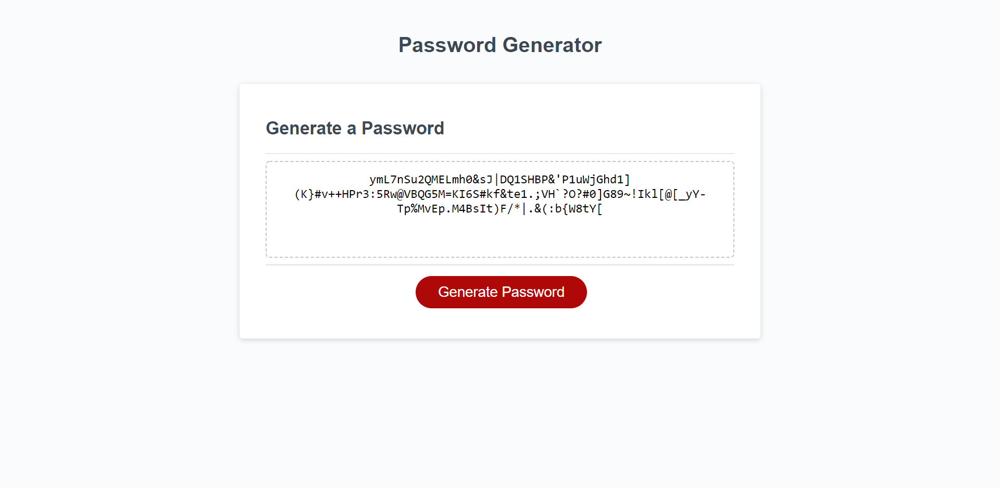

# Random-Password-Generator

<!-- ABOUT THE PROJECT -->
## About The Project

For the third challenge, `Random Password Generator`, I took the provided HTML and CSS code and did not change them. In the JavaScript file however, I created variables that kept track of how the user responded to the prompts. I also created the prompts for the user to answer along with rules the user had to follow to generate the password. Once the user has selected at least one option from the prompts, a randomly generated password is displayed which can be seen in the picture above. I used previous activites and Google as guides while creating the JavaScript file.  

<!-- BUILT WITH -->
# Built With

<ul>
    <li> HTML
    <li> CSS
    <li> JavaScript
</ul>

<!-- CONTACT -->
# Contact

Zachry Jorgensen - z.d.jorgensen@gmail.com

Project Link: [https://zdjorgensen.github.io/Random-Password-Generator/]

(<a href="#top">Back to Top</a>)
